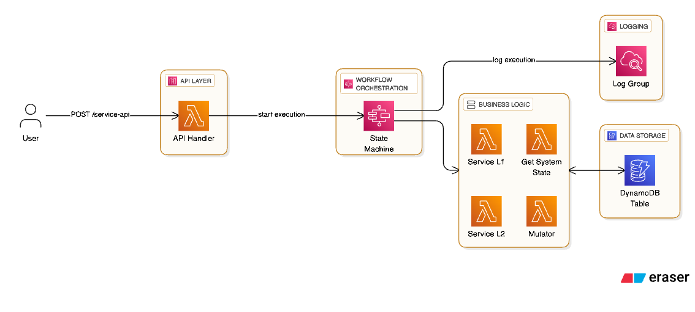
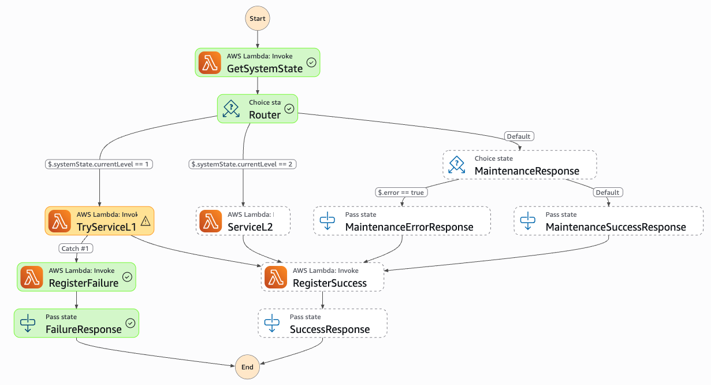

# Resilient Service System v2.0

**Self-Healing Resilient Architecture using Circuit Breaker Pattern with AWS Step Functions Express**

## 📋 Overview

This project implements an enterprise-grade resilient system using the Circuit Breaker pattern orchestrated by AWS Step Functions Express. The system automatically transitions between three operational levels (Full Capacity, Degraded Mode, and Maintenance) based on error thresholds, providing self-healing capabilities for high-throughput workloads.

## 🏗️ Architecture

### Architecture Diagram



### Workflow Diagram (Step Functions)



### System States

1. **Level 1 - Full Capacity**: Normal operations, all services available
2. **Level 2 - Degraded Mode**: Activated after 5 errors, provides limited functionality
3. **Level 3 - Maintenance**: Activated after 10 errors, system in recovery mode

### State Transitions

- **Degradation**: Errors accumulate → Level 1 → Level 2 (5 errors) → Level 3 (10 errors)
- **Recovery**: 10 consecutive genuine successes → Level 3 → Level 2 → Level 1

## 🛠️ Technical Stack

- **Runtime**: Node.js 20.x
- **Framework**: Serverless Framework v4
- **AWS Services**:
  - AWS Step Functions (Express Workflows)
  - AWS Lambda
  - Amazon DynamoDB
  - Amazon API Gateway
- **AWS SDK**: v3 (client-dynamodb, lib-dynamodb)

## 📁 Project Structure

```
resilient-service-system/
├── functions/
│   ├── get-state.js      # Fetches current system state
│   ├── services.js       # Service L1 (Full) and L2 (Degraded) handlers
│   └── mutator.js        # Atomic state updates and level transitions
├── lib/
│   └── dynamo.js         # DynamoDB client singleton
├── serverless.yml        # Infrastructure as Code
├── package.json          # Dependencies
└── README.md            # This file
```

## 🚀 Getting Started

### Prerequisites

- Node.js >= 20.0.0
- AWS CLI configured with appropriate credentials
- Serverless Framework v4

### Installation

```bash
# Install dependencies
npm install

# Deploy to AWS
npm run deploy

# Deploy to specific stage/region
serverless deploy --stage prod --region us-west-2
```

### Configuration

The system uses environment variables for configuration:

- `TABLE_NAME`: DynamoDB table name (auto-configured)
- `AWS_REGION`: AWS region (default: us-east-1)

## 📊 DynamoDB Schema

**Table Name**: `ServiceResiliencyTable-{stage}`

| Attribute    | Type   | Description                       |
| ------------ | ------ | --------------------------------- |
| PK           | String | Partition Key: `"SYSTEM_STATE"`   |
| currentLevel | Number | Current system level (1, 2, or 3) |
| errorCount   | Number | Atomic error counter              |
| lastUpdated  | String | ISO 8601 timestamp of last update |

## 🔄 Step Functions Workflow

```
Start
  ↓
GetSystemState
  ↓
Router (Choice State)
  ├─ Level 1 → TryServiceL1 → [Success/Failure]
  ├─ Level 2 → ServiceL2 → Success
  └─ Level 3 → MaintenanceResponse → Success
```

## 🧪 Testing

### Load Testing with k6

The system is designed to handle high-throughput load testing. Example k6 script:

```javascript
import http from "k6/http";
import { check } from "k6";

export let options = {
  stages: [
    { duration: "30s", target: 100 },
    { duration: "1m", target: 100 },
    { duration: "30s", target: 0 },
  ],
};

export default function () {
  const url = "YOUR_API_GATEWAY_URL/service-api";
  const payload = JSON.stringify({
    error: Math.random() > 0.8, // 20% error rate
  });

  const params = {
    headers: { "Content-Type": "application/json" },
  };

  const res = http.post(url, payload, params);

  check(res, {
    "status is 200 or 500": (r) => r.status === 200 || r.status === 500,
  });
}
```

### Manual Testing

```bash
# Test with success scenario
curl -X POST https://YOUR_API_URL/service-api \
  -H "Content-Type: application/json" \
  -d '{"error": false}'

# Test with error scenario
curl -X POST https://YOUR_API_URL/service-api \
  -H "Content-Type: application/json" \
  -d '{"error": true}'
```

## 📝 API Reference

### POST /service-api

**Request Body:**

```json
{
  "error": false
}
```

**Response (Success - Level 1):**

```json
{
  "status": 200,
  "level": 1,
  "msg": "Full Capacity"
}
```

**Response (Success - Level 2):**

```json
{
  "status": 200,
  "level": 2,
  "msg": "Degraded Mode"
}
```

**Response (Maintenance - Level 3):**

```json
{
  "status": 503,
  "message": "Nivel 3: Sistema bajo mantenimiento, intente más tarde"
}
```

**Response (Error):**

```json
{
  "status": 500,
  "message": "Internal Server Error"
}
```

## 🔍 Monitoring

View Step Functions execution logs:

```bash
# View logs for specific function
npm run logs -- --function get-state

# View CloudWatch logs for Step Functions
aws logs tail /aws/vendedlogs/states/ServiceResiliencyWorkflow-dev --follow
```

## 🧹 Cleanup

```bash
# Remove all AWS resources
npm run remove
```

## 📚 Clean Code Principles

This implementation follows clean code principles:

- **Single Responsibility**: Each Lambda function has one clear purpose
- **Dependency Injection**: DynamoDB client is centralized and reusable
- **Error Handling**: Comprehensive try/catch blocks with proper logging
- **Async/Await**: Modern asynchronous code patterns
- **No Legacy Code**: Uses AWS SDK v3 exclusively (v2 is forbidden)

## 🔐 Security

- IAM roles follow least-privilege principle
- DynamoDB access restricted to specific operations
- API Gateway with CORS enabled
- Environment variables for configuration

## 📄 License

MIT

## 👥 Contributing

This is an enterprise-grade project following strict SRD specifications. All contributions must adhere to the defined architecture and code quality standards.

## 🆘 Support

For issues or questions, please refer to the Software Requirements Document (SRD) v2.0.

---

**Status**: AUDITED & APPROVED FOR PRODUCTION  
**Version**: 2.0.0  
**Last Updated**: 2025
